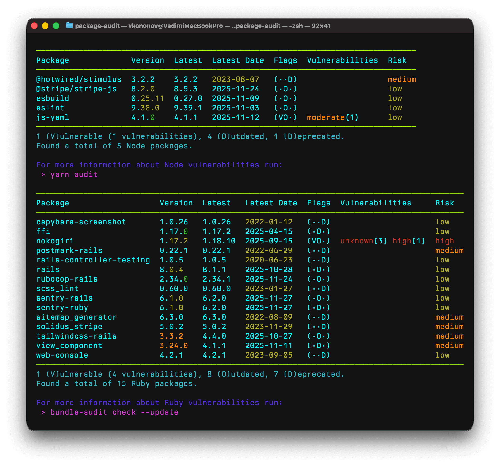

# Package::Audit

[](https://rubygems.org/gems/package-audit)
[](https://opensource.org/licenses/MIT)
[](https://github.com/vkononov/package-audit/actions/workflows/lint.yml)
[](https://github.com/vkononov/package-audit/actions/workflows/test.yml)

A useful tool for patch management and prioritization, `package-audit` produces a list of dependencies that are outdated, deprecated or have security vulnerabilities.

`Package::Audit` will automatically detect the technologies used by the project and print out an appropriate report.

[](https://www.buymeacoffee.com/vkononov)

## Supported Technologies

* Ruby
* Node (using Yarn)

## Report Example

Below is an example of running the script on a project that uses both Ruby and Node.



## Continuous Integration

This gem provides a return code of `0` to indicate success and `1` to indicate failure. It is specifically designed for seamless integration into continuous integration pipelines.

## Installation

Add this line to your application's Gemfile:

```ruby
gem 'package-audit', require: false
```

And then execute:

```bash
bundle
```

Or install it yourself as:

```bash
gem install package-audit
```

## Usage

### Basic Report

Run a full audit (DIR defaults to current directory):

```bash
package-audit [DIR]
```

### Filtering by Risk Type

Show only specific risk types:

```bash
# Show only deprecated packages
package-audit [DIR] --deprecated

# Show only vulnerable packages
package-audit [DIR] --vulnerable

# Show packages that are deprecated and/or vulnerable
package-audit [DIR] --deprecated --vulnerable
```

### Excluding Risk Types

Exclude specific risk types from the report:

```bash
# Show everything except deprecated packages
package-audit [DIR] --skip-deprecated

# Show everything except outdated packages
package-audit [DIR] --skip-outdated

# Show only vulnerable packages (exclude deprecated and outdated)
package-audit [DIR] --skip-deprecated --skip-outdated
```

**Important:** Packages with multiple risk types are handled intelligently. For example, a package that is both outdated and vulnerable will still appear when using `--skip-outdated` because it has a vulnerability.

### Understanding the Flags Column

The Flags column in the output shows which risk types apply to each package:

- `⦗V··⦘` - Vulnerable (has security vulnerabilities)
- `⦗·O·⦘` - Outdated (newer version available)
- `⦗··D⦘` - Deprecated (no updates in 2+ years)
- `⦗VO·⦘` - Both vulnerable and outdated
- `⦗VOD⦘` - All three risk types apply

The footer uses the same notation `⦗V⦘ulnerable, ⦗O⦘utdated, ⦗D⦘eprecated` as a legend.

### Scoping Options

Filter by technology or group:

```bash
# Specific technologies
package-audit [DIR] -t node -t ruby
package-audit [DIR] --technology node --technology ruby

# Specific groups
package-audit [DIR] -g staging -g production
package-audit [DIR] --group staging --group production
```

### Configuration

Use a custom configuration file (see [Configuration File](#configuration-file) for details):

```bash
package-audit [DIR] --config .package-audit.yml
```

Include packages normally ignored by configuration:

```bash
package-audit [DIR] --include-ignored
```

### Output Formats

```bash
# CSV format
package-audit [DIR] --format csv

# Markdown format
package-audit [DIR] --format md
```

### Other Commands

```bash
# Show how risk is calculated
package-audit risk

# Show version
package-audit version
```

### Getting Help

```bash
package-audit help
package-audit help [COMMAND]
```

## Configuration File

The `package-audit` gem automatically searches for `.package-audit.yml` in the current directory or in the specified `DIR` if available. However, you have the option to override the default configuration file location by using the `--config` (or `-c`) flag.

#### Below is an example of a configuration file:

```YAML
technology:
  node:
    nth-check:
      version: 1.0.2
      vulnerable: false
  ruby:
    devise-async:
      version: 1.0.0
      deprecated: false
    puma:
      version: 6.3.0
      deprecated: false
    selenium-webdriver:
      version: 4.1.0
      outdated: false
```

#### This configuration file allows you to specify the following exclusions:


* Ignore all security vulnerabilities associated with `nth-check@1.0.2`.
* Suppress messages regarding potential deprecations for  `device-async@1.0.0` and `puma@6.3.0`.
* Disable warnings about newer available versions of  `selenium-webdriver@4.1.0`

**Note:** If the installed package version differs from the expected package version specified in the configuration file, the exclusion settings will not apply to that particular package.

**Note:** If a package is reported for multiple reasons (e.g. vulnerable and outdated), it will still be reported unless the exclusion criteria match every reason for being on the report.

> By design, wildcard (`*`) version exclusions are not supported to prevent developers from inadvertently overlooking crucial messages when packages are updated.

## Development

After checking out the repo, run `bin/setup` to install dependencies. Then, run `rake test` to run the tests. You can also run `bin/console` for an interactive prompt that will allow you to experiment.

To install this gem onto your local machine, run `bundle exec rake install`. To release a new version, update the version number in `version.rb`, and then run `bundle exec rake release`, which will create a git tag for the version, push git commits and the created tag, and push the `.gem` file to [rubygems.org](https://rubygems.org).

## Contributing

Bug reports and pull requests are welcome on GitHub at https://github.com/vkononov/package-audit. This project is intended to be a safe, welcoming space for collaboration, and contributors are expected to adhere to the [code of conduct](https://github.com/vkononov/package-audit/blob/main/CODE_OF_CONDUCT.md).

## License

The gem is available as open source under the terms of the [MIT License](https://opensource.org/licenses/MIT).

## Code of Conduct

Everyone interacting in the Package::Audit project's codebases, issue trackers, chat rooms and mailing lists is expected to follow the [code of conduct](https://github.com/vkononov/package-audit/blob/main/CODE_OF_CONDUCT.md).
